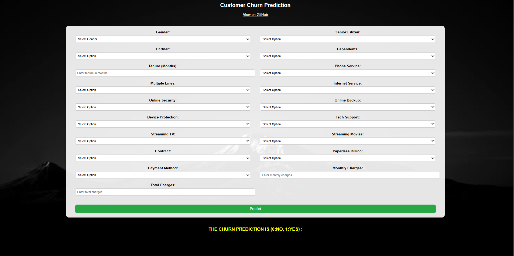

# Customer-Churn-Analyzer
This project uses classification models to detect churn risk based on features. It supports proactive customer retention  strategies.

### Dataset Description

The project uses the **Telco Customer Churn Dataset** with 7,043 records and 33 features.  
It includes customer details (e.g. contract type, charges) and churn-related columns like `Churn Value`, and `Churn Reason`.  
The dataset is used for **EDA** and **model training** to predict customer churn and understand key factors influencing it.  

### Screenshot of UI:

Here is the content for your README.md file, formatted to clearly present your project's file structure.

Markdown

# Customer Churn Analyzer

## Project Overview

This project is a customer churn analyzer that uses machine learning to predict customer churn. The repository contains the source code, data, trained models, and a web-based user interface to interact with the model.

## File and Folder Structure

The project is organized into the following directories and files for clarity and maintainability:

.
├── artifacts/
│   ├── model.pkl            # Final trained model
│   ├── preprocessor.pkl     # Data preprocessor (e.g., scaler, encoder)
│   ├── raw.csv              # Raw dataset before splitting
│   ├── test.csv             # Test dataset
│   └── train.csv            # Training dataset
|
├── notebook/
│   ├── data/
│   │   └── Telco_customer_churn.csv # Raw data file
│   ├── ordinal_encoder.pkl      # Ordinal encoder for categorical features
│   ├── trails(EDA).ipynb        # Jupyter notebook for Exploratory Data Analysis
│   └── trails(MODEL_TRAINING).ipynb # Jupyter notebook for model training
|
├── src/
│   ├── components/
│   │   ├── data_ingestion.py      # Script for data loading and splitting
│   │   ├── data_transformation.py # Script for data preprocessing
│   │   └── model_trainer.py       # Script for training the machine learning model
│   ├── pipelines/
│   │   └── prediction_pipeline.py # Script for making predictions on new data
│   ├── exception.py               # Custom exception handling
│   ├── logger.py                  # Logging functionality
│   └── utils.py                   # Utility functions
|
├── static/
│   └── images/
│       ├── background.jpeg        # Background image for the UI
│       └── project_ui.png         # Screenshot or image of the UI
|
├── templates/
│   ├── home.html                  # HTML template for the main page
│   └── index.html                 # Another HTML template for the UI
|
├── .gitignore                     # Specifies intentionally untracked files to ignore
├── app.py                         # Main Flask application file for the web UI
├── LICENSE                        # Project license
├── README.md                      # This file
├── requirements.txt               # List of project dependencies
└── setup.py                       # Python setup script

